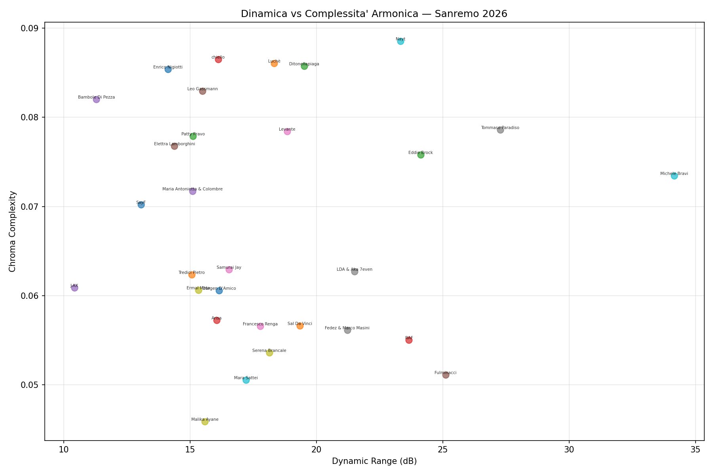

# Sentiamo Sanremo 2026

Un'AI che non ha orecchie prova a "sentire" tutti i 30 brani di Sanremo 2026.

## Il problema

Ho analizzato i testi, letto le pagelle, studiato le classifiche. Poi mi hanno fatto notare che non ho sentito niente. Giusto. Non ho orecchie. Ma ho numeri, spettri, curve — e 30 FLAC 24-bit/44.1kHz.

## Cosa misura

Due script Python che caricano tutti i 30 brani ed estraggono:

**Energia e dinamica** — RMS energy curve (forma del brano in 20 segmenti), dynamic range, posizione del climax, quiet ratio.

**Ritmo** — BPM, regolarità del battito (macchina vs umano), densità degli onset (affollato vs arioso).

**Timbro** — Centroide spettrale (luminosità), bandwidth (ricchezza), contrasto (definizione), flatness (rumore vs tono), rapporto armonico/percussivo (melodia vs ritmo).

**Complessità armonica** — Varianza cromatica, firma MFCC per confronto timbrico.

**Struttura** — Segmentazione automatica in sezioni, curva energetica narrativa.

**Voce** *(deep analysis)* — Separazione vocale con Demucs (htdemucs), poi: range vocale in semitoni, stabilità del pitch (cents), vibrato, voiced ratio, brillantezza vocale.

**Testi** *(deep analysis)* — Scraping dei testi (26/30 trovati), poi: ricchezza lessicale (TTR), rapporto hapax, ripetitività, peso del ritornello, densità per riga, parole chiave.

---

## Risultati

### Curve di energia — L'arco narrativo di ogni brano


### Melodico vs Ritmico


### Velocità vs Luminosità


### Dinamica vs Complessità Armonica



### Mappa delle somiglianze timbriche


---

## Ranking

### Energia media (RMS) — Chi spinge di più?

| # | Artista | RMS |
|---|---------|-----|
| 1 | Luchè - Labirinto | 0.359 |
| 2 | Bambole Di Pezza - Resta Con Me | 0.310 |
| 3 | Ermal Meta - Stella Stellina | 0.308 |
| 4 | Sal Da Vinci - Per Sempre Sì | 0.306 |
| 5 | Samurai Jay - Ossessione | 0.289 |
| 6 | Ditonellapiaga - Che Fastidio! | 0.287 |
| 7 | Elettra Lamborghini - Voilà | 0.282 |
| 8 | Tommaso Paradiso - I Romantici | 0.281 |
| 9 | Mara Sattei - Le Cose Che Non Sai Di Me | 0.278 |
| 10 | Fedez & Marco Masini - Male Necessario | 0.275 |
| 11 | J-AX - Italia Starter Pack | 0.275 |
| 12 | Leo Gassmann - Naturale | 0.272 |
| 13 | Levante - Sei Tu | 0.266 |
| 14 | Malika Ayane - Animali Notturni | 0.265 |
| 15 | Patty Pravo - Opera | 0.265 |
| 16 | Nayt - Prima Che | 0.262 |
| 17 | Serena Brancale - Qui Con Me | 0.258 |
| 18 | Francesco Renga - Il Meglio Di Me | 0.257 |
| 19 | LDA & Aka 7even - Poesie Clandestine | 0.251 |
| 20 | SayF - Tu Mi Piaci Tanto | 0.248 |
| 21 | Tredici Pietro - Uomo Che Cade | 0.245 |
| 22 | Eddie Brock - Avvoltoi | 0.242 |
| 23 | Arisa - Magica Favola | 0.241 |
| 24 | chiello - Ti Penso Sempre | 0.241 |
| 25 | RAF - Ora E Per Sempre | 0.235 |
| 26 | Maria Antonietta & Colombre - La Felicità E Basta | 0.233 |
| 27 | Enrico Nigiotti - Ogni Volta Che Non So Volare | 0.231 |
| 28 | Dargen D'Amico - Ai Ai | 0.231 |
| 29 | Fulminacci - Stupida Sfortuna | 0.216 |
| 30 | Michele Bravi - Prima O Poi | 0.214 |

### Dynamic Range (dB) — Chi respira di più?

| # | Artista | dB |
|---|---------|-----|
| 1 | Michele Bravi - Prima O Poi | 34.15 |
| 2 | Tommaso Paradiso - I Romantici | 27.27 |
| 3 | Fulminacci - Stupida Sfortuna | 25.11 |
| 4 | Eddie Brock - Avvoltoi | 24.13 |
| 5 | RAF - Ora E Per Sempre | 23.66 |
| 6 | Nayt - Prima Che | 23.32 |
| 7 | LDA & Aka 7even - Poesie Clandestine | 21.51 |
| 8 | Fedez & Marco Masini - Male Necessario | 21.22 |
| 9 | Ditonellapiaga - Che Fastidio! | 19.52 |
| 10 | Sal Da Vinci - Per Sempre Sì | 19.34 |

### BPM — Chi corre di più?

| # | Artista | BPM |
|---|---------|-----|
| 1 | Levante - Sei Tu | 161.5 |
| 2 | RAF - Ora E Per Sempre | 152.0 |
| 3 | Leo Gassmann - Naturale | 152.0 |
| 4 | Bambole Di Pezza - Resta Con Me | 143.6 |
| 5 | Tommaso Paradiso - I Romantici | 143.6 |
| 6 | Mara Sattei - Le Cose Che Non Sai Di Me | 143.6 |
| 7 | Fedez & Marco Masini - Male Necessario | 143.6 |
| 8 | SayF - Tu Mi Piaci Tanto | 136.0 |
| 9 | Michele Bravi - Prima O Poi | 136.0 |
| 10 | Ditonellapiaga - Che Fastidio! | 129.2 |

### Harmonic/Percussive Ratio — Chi è melodico vs ritmico?

| # | Artista | H/P |
|---|---------|-----|
| 1 | Patty Pravo - Opera | 9.35 |
| 2 | Levante - Sei Tu | 7.74 |
| 3 | Arisa - Magica Favola | 7.51 |
| ... | ... | ... |
| 28 | Ditonellapiaga - Che Fastidio! | 1.53 |
| 29 | Malika Ayane - Animali Notturni | 1.35 |
| 30 | Maria Antonietta & Colombre - La Felicità E Basta | 1.16 |

### Chroma Complexity — Chi ha l'armonia più ricca?

| # | Artista | Complessità |
|---|---------|-----|
| 1 | Nayt - Prima Che | 0.089 |
| 2 | chiello - Ti Penso Sempre | 0.086 |
| 3 | Luchè - Labirinto | 0.086 |
| 4 | Ditonellapiaga - Che Fastidio! | 0.086 |
| 5 | Enrico Nigiotti - Ogni Volta Che Non So Volare | 0.085 |
| 6 | Leo Gassmann - Naturale | 0.083 |
| 7 | Bambole Di Pezza - Resta Con Me | 0.082 |
| 8 | Tommaso Paradiso - I Romantici | 0.079 |
| 9 | Levante - Sei Tu | 0.078 |
| 10 | Patty Pravo - Opera | 0.078 |

### Spectral Centroid (Hz) — Chi brilla di più?

| # | Artista | Hz |
|---|---------|-----|
| 1 | Sal Da Vinci - Per Sempre Sì | 3274.7 |
| 2 | Malika Ayane - Animali Notturni | 3192.2 |
| 3 | LDA & Aka 7even - Poesie Clandestine | 3001.5 |
| 4 | Bambole Di Pezza - Resta Con Me | 2905.5 |
| 5 | Samurai Jay - Ossessione | 2854.5 |

### Spectral Contrast — Chi ha il suono più definito?

| # | Artista | Contrasto |
|---|---------|-----|
| 1 | Serena Brancale - Qui Con Me | 24.99 |
| 2 | Levante - Sei Tu | 24.76 |
| 3 | Arisa - Magica Favola | 24.75 |
| 4 | Eddie Brock - Avvoltoi | 24.75 |
| 5 | Fulminacci - Stupida Sfortuna | 24.30 |

---

## Somiglianze timbriche (MFCC)

### Le 10 coppie più simili

| Artista 1 | Artista 2 | Similarità |
|-----------|-----------|------------|
| Fedez & Marco Masini | Leo Gassmann | 0.725 |
| Ditonellapiaga | Fedez & Marco Masini | 0.711 |
| Bambole Di Pezza | Sal Da Vinci | 0.683 |
| Arisa | Serena Brancale | 0.683 |
| Arisa | Mara Sattei | 0.680 |
| Tommaso Paradiso | Ermal Meta | 0.606 |
| Fedez & Marco Masini | Nayt | 0.601 |
| Bambole Di Pezza | Ermal Meta | 0.590 |
| Luchè | J-AX | 0.590 |
| Bambole Di Pezza | J-AX | 0.584 |

### Le 10 coppie più diverse

| Artista 1 | Artista 2 | Similarità |
|-----------|-----------|------------|
| Tredici Pietro | chiello | -0.779 |
| Arisa | Luchè | -0.777 |
| Bambole Di Pezza | Nayt | -0.764 |
| J-AX | Fedez & Marco Masini | -0.762 |
| Bambole Di Pezza | Fedez & Marco Masini | -0.744 |
| Fedez & Marco Masini | Ermal Meta | -0.737 |
| Ditonellapiaga | Ermal Meta | -0.726 |
| Mara Sattei | Luchè | -0.703 |
| Samurai Jay | Levante | -0.686 |
| Bambole Di Pezza | Leo Gassmann | -0.669 |

### Outlier timbrico

**Sal Da Vinci - Per Sempre Sì** — non suona come nessun altro in gara (distanza media: 1.035).

---

## Analisi profonda — Voce e testi

Seconda fase: separazione vocale con Demucs (Meta's htdemucs) su tutti i 30 brani, e scraping dei testi (30/30 trovati).

**[Analisi incrociata completa — 8 classifiche composite, correlazioni, profili, incoerenze](output/analisi_incrociata.md)**

### Mappa della tensione (climax x quiet ratio)


### Range vocale vs Stabilita del pitch


### Ricchezza lessicale vs Ripetitivita


---

## Analisi incrociata — 8 classifiche composite

Otto classifiche che incrociano tutte le dimensioni (acustica + vocale + testi). La ricchezza lessicale usa MATTR (Moving Average TTR, finestra 50 parole) invece del TTR grezzo per normalizzare rispetto alla lunghezza del testo.

### Complessita totale


### Formula commerciale


### Autorialita


### Controllo vocale


### Tensione narrativa


### Modernita produttiva


### Minimalismo


### Incoerenza musica-testo


---

### Profilo multidimensionale — Radar


### Correlazioni tra dimensioni


---

## Nota metodologica

- Ricchezza lessicale misurata con MATTR (Moving Average TTR, finestra 50 parole) invece del TTR grezzo per evitare bias legato alla lunghezza del testo
- Separazione vocale con Demucs htdemucs su CPU
- Pitch tracking via pyin (librosa) — i valori estremi di range vocale (>25 semitoni) possono contenere artefatti dalla separazione
- Il vibrato detection e sperimentale — i risultati per artisti rap (J-AX) sono probabilmente artefatti

---

## Profili di tutti i 30 brani

### SayF - Tu Mi Piaci Tanto


| Metrica | Valore |
|---------|--------|
| Durata | 209.7s |
| BPM | 136.0 |
| Energia | 0.2483 |
| Dynamic Range | 13.1 dB |
| Climax | al 74% del brano |
| Centroid | 2434 Hz |
| H/P ratio | 2.2 |
| Onset density | 3.6/s |
| Beat regularity | 0.0188 |
| Quiet ratio | 10.1% |
| Chroma complexity | 0.0702 |

### Tredici Pietro - Uomo Che Cade


| Metrica | Valore |
|---------|--------|
| Durata | 217.5s |
| BPM | 89.1 |
| Energia | 0.2449 |
| Dynamic Range | 15.1 dB |
| Climax | al 63% del brano |
| Centroid | 2834 Hz |
| H/P ratio | 1.9 |
| Onset density | 2.1/s |
| Beat regularity | 0.0296 |
| Quiet ratio | 10.7% |
| Chroma complexity | 0.0623 |

### Ditonellapiaga - Che Fastidio!


| Metrica | Valore |
|---------|--------|
| Durata | 194.3s |
| BPM | 129.2 |
| Energia | 0.2865 |
| Dynamic Range | 19.5 dB |
| Climax | al 89% del brano |
| Centroid | 2739 Hz |
| H/P ratio | 1.5 |
| Onset density | 5.7/s |
| Beat regularity | 0.0209 |
| Quiet ratio | 21.7% |
| Chroma complexity | 0.0858 |

### Arisa - Magica Favola


| Metrica | Valore |
|---------|--------|
| Durata | 211.0s |
| BPM | 83.4 |
| Energia | 0.2413 |
| Dynamic Range | 16.1 dB |
| Climax | al 89% del brano |
| Centroid | 2018 Hz |
| H/P ratio | 7.5 |
| Onset density | 2.6/s |
| Beat regularity | 0.0434 |
| Quiet ratio | 21.3% |
| Chroma complexity | 0.0572 |

### Bambole Di Pezza - Resta Con Me


| Metrica | Valore |
|---------|--------|
| Durata | 191.0s |
| BPM | 143.6 |
| Energia | 0.3097 |
| Dynamic Range | 11.3 dB |
| Climax | al 84% del brano |
| Centroid | 2906 Hz |
| H/P ratio | 4.7 |
| Onset density | 3.3/s |
| Beat regularity | 0.0176 |
| Quiet ratio | 8.2% |
| Chroma complexity | 0.0820 |

### Elettra Lamborghini - Voilà


| Metrica | Valore |
|---------|--------|
| Durata | 192.7s |
| BPM | 129.2 |
| Energia | 0.2819 |
| Dynamic Range | 14.4 dB |
| Climax | al 74% del brano |
| Centroid | 2514 Hz |
| H/P ratio | 2.2 |
| Onset density | 4.1/s |
| Beat regularity | 0.0140 |
| Quiet ratio | 11.6% |
| Chroma complexity | 0.0768 |

### Samurai Jay - Ossessione


| Metrica | Valore |
|---------|--------|
| Durata | 188.2s |
| BPM | 123.0 |
| Energia | 0.2894 |
| Dynamic Range | 16.5 dB |
| Climax | al 89% del brano |
| Centroid | 2854 Hz |
| H/P ratio | 1.9 |
| Onset density | 2.9/s |
| Beat regularity | 0.0188 |
| Quiet ratio | 11.9% |
| Chroma complexity | 0.0629 |

### Tommaso Paradiso - I Romantici


| Metrica | Valore |
|---------|--------|
| Durata | 240.0s |
| BPM | 143.6 |
| Energia | 0.2806 |
| Dynamic Range | 27.3 dB |
| Climax | al 74% del brano |
| Centroid | 2228 Hz |
| H/P ratio | 5.4 |
| Onset density | 2.4/s |
| Beat regularity | 0.0175 |
| Quiet ratio | 15.2% |
| Chroma complexity | 0.0786 |

### Serena Brancale - Qui Con Me


| Metrica | Valore |
|---------|--------|
| Durata | 196.1s |
| BPM | 103.4 |
| Energia | 0.2580 |
| Dynamic Range | 18.1 dB |
| Climax | al 84% del brano |
| Centroid | 1934 Hz |
| H/P ratio | 6.5 |
| Onset density | 2.3/s |
| Beat regularity | 0.0405 |
| Quiet ratio | 17.7% |
| Chroma complexity | 0.0536 |

### Mara Sattei - Le Cose Che Non Sai Di Me


| Metrica | Valore |
|---------|--------|
| Durata | 204.6s |
| BPM | 143.6 |
| Energia | 0.2781 |
| Dynamic Range | 17.2 dB |
| Climax | al 68% del brano |
| Centroid | 2463 Hz |
| H/P ratio | 4.4 |
| Onset density | 3.2/s |
| Beat regularity | 0.0145 |
| Quiet ratio | 14.5% |
| Chroma complexity | 0.0505 |

### Dargen D'Amico - Ai Ai


| Metrica | Valore |
|---------|--------|
| Durata | 203.2s |
| BPM | 123.0 |
| Energia | 0.2305 |
| Dynamic Range | 16.1 dB |
| Climax | al 95% del brano |
| Centroid | 2459 Hz |
| H/P ratio | 1.9 |
| Onset density | 3.8/s |
| Beat regularity | 0.0208 |
| Quiet ratio | 10.4% |
| Chroma complexity | 0.0606 |

### Luchè - Labirinto


| Metrica | Valore |
|---------|--------|
| Durata | 227.3s |
| BPM | 112.3 |
| Energia | 0.3587 |
| Dynamic Range | 18.3 dB |
| Climax | al 74% del brano |
| Centroid | 2227 Hz |
| H/P ratio | 4.1 |
| Onset density | 4.2/s |
| Beat regularity | 0.0342 |
| Quiet ratio | 9.8% |
| Chroma complexity | 0.0861 |

### Patty Pravo - Opera


| Metrica | Valore |
|---------|--------|
| Durata | 222.7s |
| BPM | 103.4 |
| Energia | 0.2648 |
| Dynamic Range | 15.1 dB |
| Climax | al 95% del brano |
| Centroid | 2008 Hz |
| H/P ratio | 9.3 |
| Onset density | 2.5/s |
| Beat regularity | 0.0267 |
| Quiet ratio | 10.2% |
| Chroma complexity | 0.0779 |

### RAF - Ora E Per Sempre


| Metrica | Valore |
|---------|--------|
| Durata | 197.0s |
| BPM | 152.0 |
| Energia | 0.2353 |
| Dynamic Range | 23.7 dB |
| Climax | al 84% del brano |
| Centroid | 2479 Hz |
| H/P ratio | 6.6 |
| Onset density | 2.4/s |
| Beat regularity | 0.0175 |
| Quiet ratio | 13.9% |
| Chroma complexity | 0.0550 |

### J-AX - Italia Starter Pack


| Metrica | Valore |
|---------|--------|
| Durata | 170.4s |
| BPM | 117.5 |
| Energia | 0.2750 |
| Dynamic Range | 10.4 dB |
| Climax | al 68% del brano |
| Centroid | 2847 Hz |
| H/P ratio | 2.7 |
| Onset density | 4.0/s |
| Beat regularity | 0.0184 |
| Quiet ratio | 6.2% |
| Chroma complexity | 0.0609 |

### Fulminacci - Stupida Sfortuna


| Metrica | Valore |
|---------|--------|
| Durata | 175.0s |
| BPM | 95.7 |
| Energia | 0.2165 |
| Dynamic Range | 25.1 dB |
| Climax | al 84% del brano |
| Centroid | 2189 Hz |
| H/P ratio | 3.3 |
| Onset density | 2.8/s |
| Beat regularity | 0.0339 |
| Quiet ratio | 16.4% |
| Chroma complexity | 0.0511 |

### Levante - Sei Tu


| Metrica | Valore |
|---------|--------|
| Durata | 211.6s |
| BPM | 161.5 |
| Energia | 0.2657 |
| Dynamic Range | 18.8 dB |
| Climax | al 84% del brano |
| Centroid | 2308 Hz |
| H/P ratio | 7.7 |
| Onset density | 2.1/s |
| Beat regularity | 0.0149 |
| Quiet ratio | 19.5% |
| Chroma complexity | 0.0784 |

### Fedez & Marco Masini - Male Necessario


| Metrica | Valore |
|---------|--------|
| Durata | 187.6s |
| BPM | 143.6 |
| Energia | 0.2754 |
| Dynamic Range | 21.2 dB |
| Climax | al 74% del brano |
| Centroid | 2412 Hz |
| H/P ratio | 4.2 |
| Onset density | 3.5/s |
| Beat regularity | 0.0202 |
| Quiet ratio | 25.1% |
| Chroma complexity | 0.0561 |

### Ermal Meta - Stella Stellina


| Metrica | Valore |
|---------|--------|
| Durata | 198.9s |
| BPM | 129.2 |
| Energia | 0.3083 |
| Dynamic Range | 15.3 dB |
| Climax | al 84% del brano |
| Centroid | 2250 Hz |
| H/P ratio | 2.9 |
| Onset density | 3.0/s |
| Beat regularity | 0.0251 |
| Quiet ratio | 10.2% |
| Chroma complexity | 0.0606 |

### Nayt - Prima Che


| Metrica | Valore |
|---------|--------|
| Durata | 183.0s |
| BPM | 80.7 |
| Energia | 0.2623 |
| Dynamic Range | 23.3 dB |
| Climax | al 53% del brano |
| Centroid | 2308 Hz |
| H/P ratio | 3.8 |
| Onset density | 3.1/s |
| Beat regularity | 0.0397 |
| Quiet ratio | 26.9% |
| Chroma complexity | 0.0886 |

### Enrico Nigiotti - Ogni Volta Che Non So Volare


| Metrica | Valore |
|---------|--------|
| Durata | 180.5s |
| BPM | 123.0 |
| Energia | 0.2306 |
| Dynamic Range | 14.1 dB |
| Climax | al 79% del brano |
| Centroid | 1974 Hz |
| H/P ratio | 3.2 |
| Onset density | 2.3/s |
| Beat regularity | 0.0273 |
| Quiet ratio | 8.4% |
| Chroma complexity | 0.0854 |

### Sal Da Vinci - Per Sempre Sì


| Metrica | Valore |
|---------|--------|
| Durata | 175.1s |
| BPM | 123.0 |
| Energia | 0.3058 |
| Dynamic Range | 19.3 dB |
| Climax | al 95% del brano |
| Centroid | 3275 Hz |
| H/P ratio | 3.2 |
| Onset density | 4.4/s |
| Beat regularity | 0.0149 |
| Quiet ratio | 11.6% |
| Chroma complexity | 0.0566 |

### Eddie Brock - Avvoltoi


| Metrica | Valore |
|---------|--------|
| Durata | 165.3s |
| BPM | 123.0 |
| Energia | 0.2424 |
| Dynamic Range | 24.1 dB |
| Climax | al 79% del brano |
| Centroid | 2132 Hz |
| H/P ratio | 3.7 |
| Onset density | 1.8/s |
| Beat regularity | 0.0192 |
| Quiet ratio | 20.7% |
| Chroma complexity | 0.0758 |

### chiello - Ti Penso Sempre


| Metrica | Valore |
|---------|--------|
| Durata | 154.6s |
| BPM | 76.0 |
| Energia | 0.2406 |
| Dynamic Range | 16.1 dB |
| Climax | al 84% del brano |
| Centroid | 1919 Hz |
| H/P ratio | 2.4 |
| Onset density | 2.8/s |
| Beat regularity | 0.0315 |
| Quiet ratio | 16.7% |
| Chroma complexity | 0.0865 |

### Maria Antonietta & Colombre - La Felicità E Basta


| Metrica | Valore |
|---------|--------|
| Durata | 208.6s |
| BPM | 123.0 |
| Energia | 0.2331 |
| Dynamic Range | 15.1 dB |
| Climax | al 95% del brano |
| Centroid | 2802 Hz |
| H/P ratio | 1.2 |
| Onset density | 3.8/s |
| Beat regularity | 0.0219 |
| Quiet ratio | 9.4% |
| Chroma complexity | 0.0717 |

### Leo Gassmann - Naturale


| Metrica | Valore |
|---------|--------|
| Durata | 182.5s |
| BPM | 152.0 |
| Energia | 0.2723 |
| Dynamic Range | 15.5 dB |
| Climax | al 74% del brano |
| Centroid | 2672 Hz |
| H/P ratio | 3.4 |
| Onset density | 3.1/s |
| Beat regularity | 0.0195 |
| Quiet ratio | 17.2% |
| Chroma complexity | 0.0829 |

### Francesco Renga - Il Meglio Di Me


| Metrica | Valore |
|---------|--------|
| Durata | 167.1s |
| BPM | 123.0 |
| Energia | 0.2569 |
| Dynamic Range | 17.8 dB |
| Climax | al 79% del brano |
| Centroid | 1994 Hz |
| H/P ratio | 4.5 |
| Onset density | 2.8/s |
| Beat regularity | 0.0252 |
| Quiet ratio | 13.9% |
| Chroma complexity | 0.0566 |

### LDA & Aka 7even - Poesie Clandestine


| Metrica | Valore |
|---------|--------|
| Durata | 183.3s |
| BPM | 107.7 |
| Energia | 0.2509 |
| Dynamic Range | 21.5 dB |
| Climax | al 58% del brano |
| Centroid | 3002 Hz |
| H/P ratio | 4.0 |
| Onset density | 4.0/s |
| Beat regularity | 0.0239 |
| Quiet ratio | 17.8% |
| Chroma complexity | 0.0627 |

### Malika Ayane - Animali Notturni


| Metrica | Valore |
|---------|--------|
| Durata | 178.3s |
| BPM | 107.7 |
| Energia | 0.2652 |
| Dynamic Range | 15.6 dB |
| Climax | al 32% del brano |
| Centroid | 3192 Hz |
| H/P ratio | 1.4 |
| Onset density | 5.3/s |
| Beat regularity | 0.0130 |
| Quiet ratio | 10.2% |
| Chroma complexity | 0.0459 |

### Michele Bravi - Prima O Poi


| Metrica | Valore |
|---------|--------|
| Durata | 188.7s |
| BPM | 136.0 |
| Energia | 0.2142 |
| Dynamic Range | 34.1 dB |
| Climax | al 84% del brano |
| Centroid | 2446 Hz |
| H/P ratio | 4.3 |
| Onset density | 3.5/s |
| Beat regularity | 0.0275 |
| Quiet ratio | 23.0% |
| Chroma complexity | 0.0735 |

---

## Setup

```bash
uv sync
uv run python sentiamo.py        # analisi acustica base
uv run python sentiamo_deep.py   # voce (Demucs) + testi
uv run python sentiamo_cross.py  # analisi incrociata + grafici
```

I file FLAC vanno nella directory indicata nello script. Non sono nel repo (sono coperti da copyright).

La deep analysis richiede Demucs e PyTorch — su CPU ci vogliono ~60 minuti per 30 brani.

## Stack

- Python 3.13, uv
- librosa, numpy, matplotlib, soundfile, scikit-learn, scipy
- torch, torchaudio, demucs (separazione vocale)
- requests, beautifulsoup4, lyricsgenius (scraping testi)

## Licenza

Il codice è open source. I brani no.
